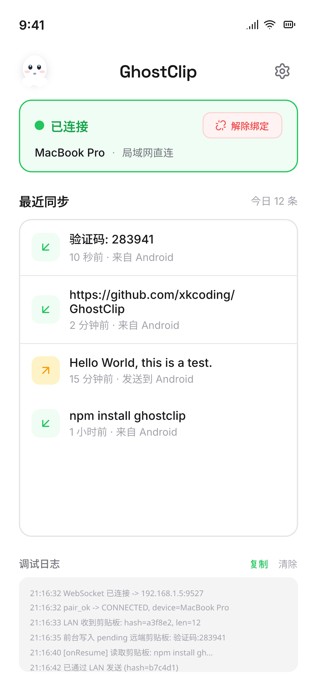
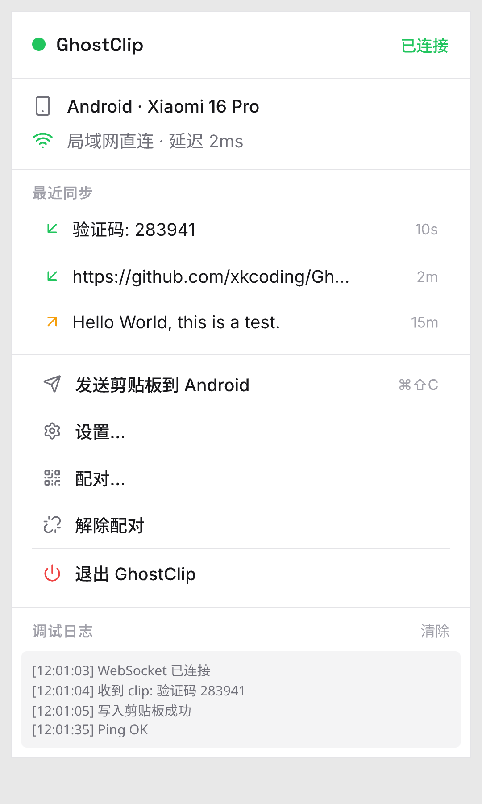
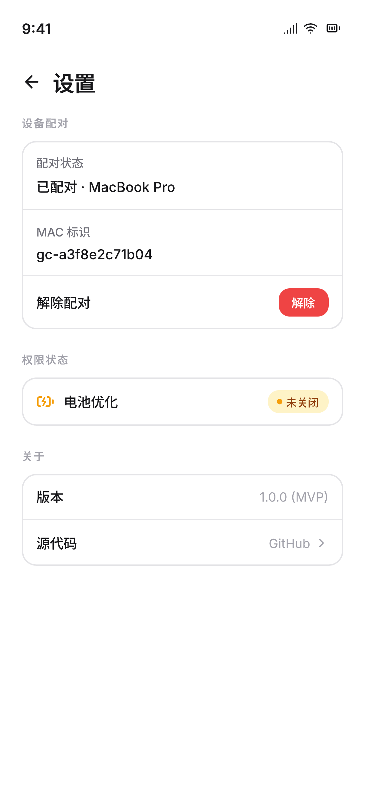
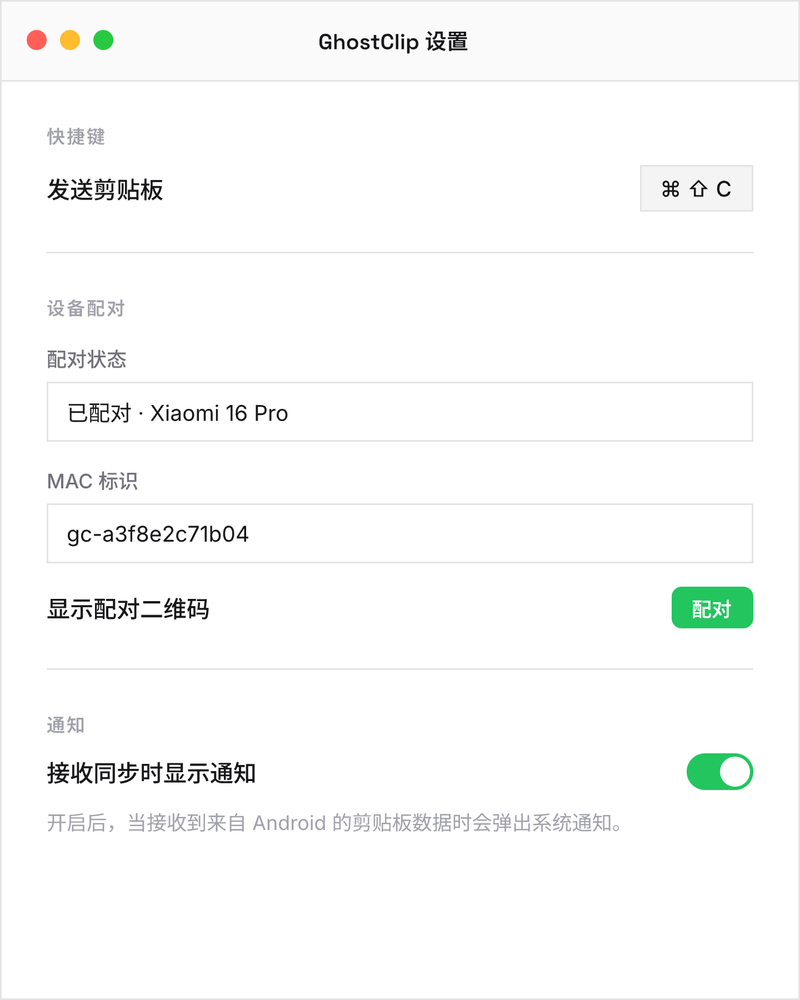

<p align="center">
  
</p>

<h1 align="center">GhostClip</h1>

<p align="center">
  Android 与 Mac 之间的文本剪贴板同步，局域网直连，数据不经云端。
</p>

<p align="center">
  <a href="https://github.com/xkcoding/GhostClip/releases/latest"></a>
  <a href="LICENSE"></a>
  <a href="https://ghostclip.no-bug.dev"></a>
</p>

---

## 截图

| Android | Mac |
|:-------:|:---:|
|  |  |
|  |  |

## 特性

- **局域网直连** — 同一 WiFi 下 mDNS 自动发现 + WebSocket 直连
- **扫码配对** — Mac 端显示二维码，Android 扫码即连
- **非对称同步** — Android 复制后点击悬浮球自动发送；Mac 端 `Cmd+Shift+C` 手动推送
- **通知可操作** — 收到剪贴板后弹出通知，点击即复制
- **断线重连** — 网络切换、断线后自动恢复连接
- **Menu Bar 常驻** — Mac 端常驻菜单栏，不占 Dock

## 项目结构

| 组件 | 目录 | 技术栈 |
|------|------|--------|
| Mac 端 | `mac/` | Tauri v2 — Rust 后端 (NSPasteboard, mDNS, WebSocket) + Web 前端 |
| Android 端 | `android/` | Kotlin — Foreground Service + OkHttp WebSocket |
| Landing Page | `site/` | Astro — 部署于 Cloudflare Pages |

## 架构

<p align="center">
  
</p>

## 安装

### Mac

```bash
brew install --cask xkcoding/tap/ghostclip
```

或从 [Releases](https://github.com/xkcoding/GhostClip/releases/latest) 下载 DMG 手动安装。

### Android

从 [Releases](https://github.com/xkcoding/GhostClip/releases/latest) 下载 APK 安装。

## 使用

**配对**

1. 确保两台设备在同一 WiFi
2. Mac 端：Menu Bar 图标 → 设置 → 扫码配对
3. Android 端：打开 GhostClip → 扫码配对
4. 扫描成功后自动建立连接

**Android → Mac**

复制文字 → 点击系统悬浮球打开 GhostClip → 自动发送到 Mac → `Cmd+V` 粘贴

**Mac → Android**

`Cmd+C` 复制 → `Cmd+Shift+C` 发送 → Android 收到通知，点击即复制

## 技术细节

- **去重**：两端各维护 MD5 Hash 池（LRU, 3s TTL），避免同步回环
- **鉴权**：IOKit MAC hash + ephemeral token，WebSocket 连接需携带 token
- **仅文本**：当前版本仅支持纯文本同步

## 更新日志

见 [CHANGELOG.md](CHANGELOG.md)。

## License

[MIT](LICENSE)
